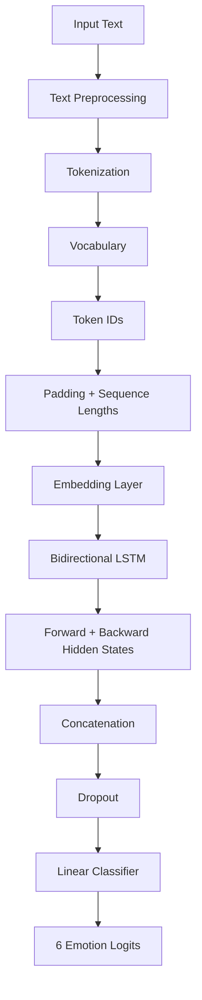
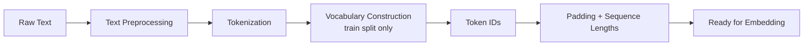
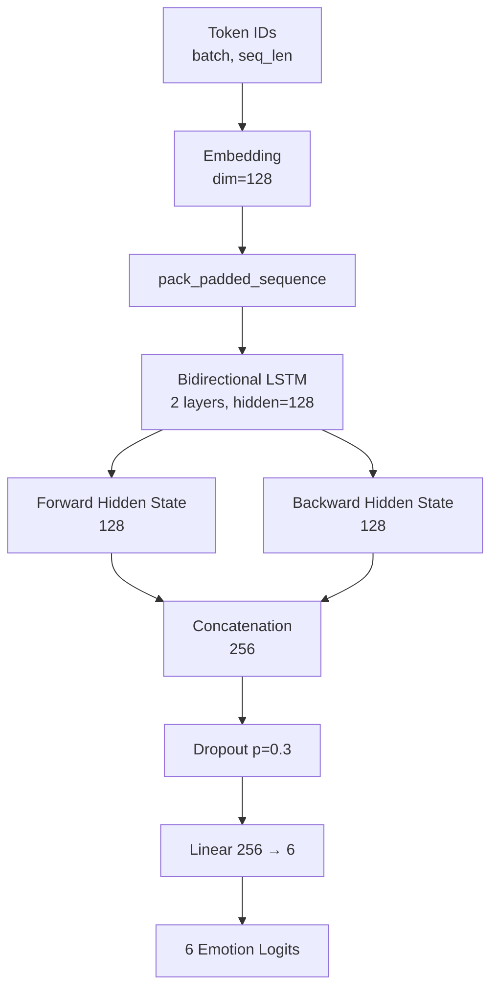
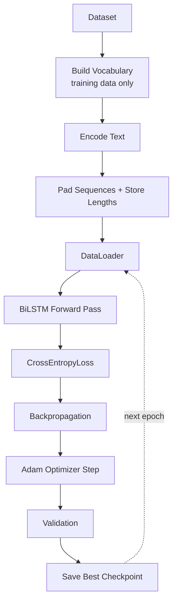
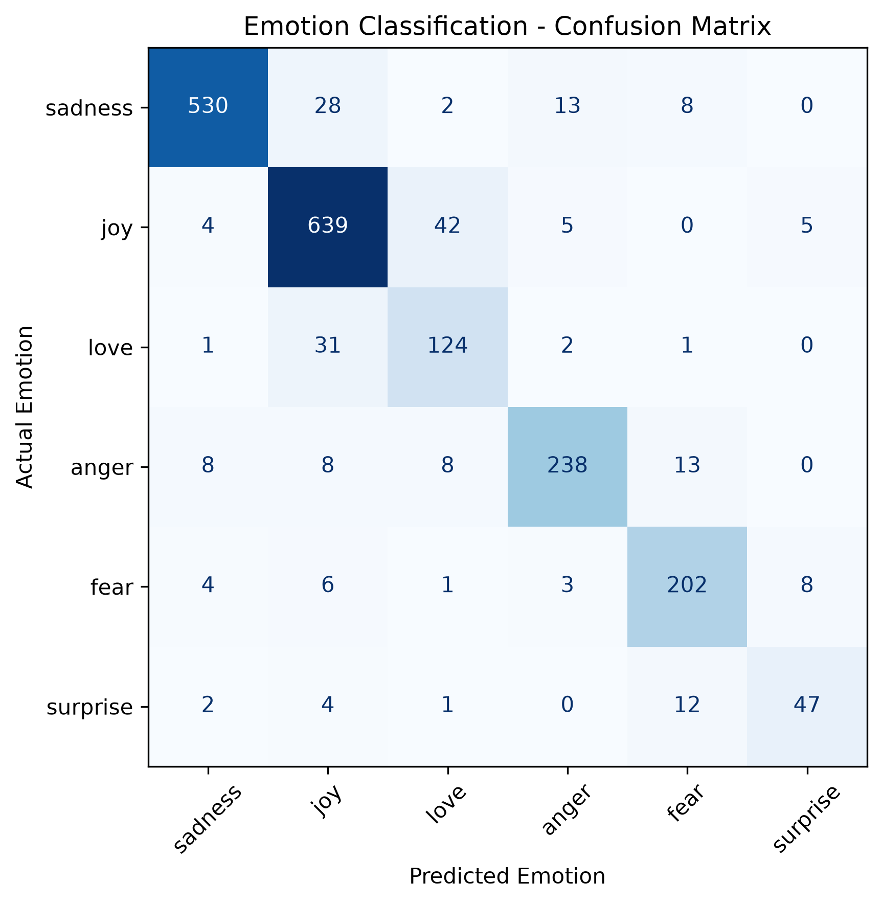
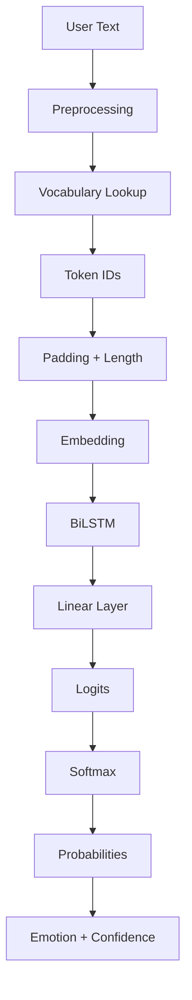
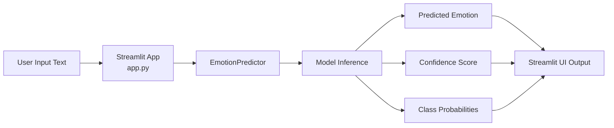

# Emotion Classification with BiLSTM

A deep learning NLP project that classifies text into six human emotions using a Bidirectional LSTM (BiLSTM) implemented with PyTorch.

[](https://www.python.org/)
[](https://pytorch.org/)
[](https://huggingface.co/datasets/dair-ai/emotion)
[](https://streamlit.io/)

---

## Key Results

| Metric | Score |
|---|---|
| Accuracy | 0.8900 |
| Precision (weighted) | 0.8931 |
| Recall (weighted) | 0.8900 |
| Weighted F1 | 0.8908 |
| Macro F1 | 0.8500 |

The gap between weighted F1 (0.8908) and macro F1 (0.8500) reflects class imbalance in the dataset — minority classes such as `love` and `surprise` pull the macro average down relative to the weighted average.

---

## Demo

The project ships with a Streamlit application (`app.py`) for interactive inference. Given an input sentence, the app predicts the emotion, displays a confidence score, and shows the full probability distribution across all six classes.

```bash
streamlit run app.py
```

---

## Architecture Overview



---

## Dataset

The model is trained on [`dair-ai/emotion`](https://huggingface.co/datasets/dair-ai/emotion) from Hugging Face Datasets.

| Split | Samples |
|---|---|
| Train | 16,000 |
| Validation | 2,000 |
| Test | 2,000 |
| **Total** | **20,000** |

### Classes

| Label | Emotion |
|---|---|
| 0 | sadness |
| 1 | joy |
| 2 | love |
| 3 | anger |
| 4 | fear |
| 5 | surprise |

### Class Distribution


---

## Data Preprocessing Pipeline



The vocabulary is built using **only the training split** to prevent data leakage from validation or test text into the token vocabulary. The final trained vocabulary size is **15,214** tokens.

Sequences are padded to a maximum length of 50 tokens, and the true (unpadded) length of each sequence is retained so that padded positions can be excluded from the LSTM's computation via `pack_padded_sequence()`. This ensures the model does not treat padding tokens as meaningful sequence information.

---

## Model Architecture



### Configuration

| Hyperparameter | Value |
|---|---|
| Vocabulary size | 15,214 |
| Embedding dimension | 128 |
| Hidden dimension | 128 |
| LSTM layers | 2 |
| Bidirectional | True |
| Dropout | 0.3 |
| Number of classes | 6 |
| Maximum sequence length | 50 |
| Optimizer | Adam |
| Loss function | CrossEntropyLoss |

Because the LSTM is bidirectional, the forward and backward hidden states (128 each) are concatenated into a 256-dimensional representation before being passed to the final linear classifier (`Linear(256, 6)`).

---

## Training Pipeline



The best-performing checkpoint on the validation set is saved to `models/emotion_bilstm.pt`.

```bash
python -m src.train
```

---

## Evaluation

```bash
python -m src.evaluate
```

### Per-Class Results

| Emotion | Precision | Recall | F1-score | Support |
|---|---|---|---|---|
| sadness | 0.97 | 0.91 | 0.94 | 581 |
| joy | 0.89 | 0.92 | 0.91 | 695 |
| love | 0.70 | 0.78 | 0.74 | 159 |
| anger | 0.91 | 0.87 | 0.89 | 275 |
| fear | 0.86 | 0.90 | 0.88 | 224 |
| surprise | 0.78 | 0.71 | 0.75 | 66 |

### Confusion Matrix



Raw counts (rows = true label, columns = predicted label, order: sadness, joy, love, anger, fear, surprise):

|  | sadness | joy | love | anger | fear | surprise |
|---|---|---|---|---|---|---|
| **sadness** | 530 | 28 | 2 | 13 | 8 | 0 |
| **joy** | 4 | 639 | 42 | 5 | 0 | 5 |
| **love** | 1 | 31 | 124 | 2 | 1 | 0 |
| **anger** | 8 | 8 | 8 | 238 | 13 | 0 |
| **fear** | 4 | 6 | 1 | 3 | 202 | 8 |
| **surprise** | 2 | 4 | 1 | 0 | 12 | 47 |

---

## Error Analysis

- **Strongest class**: `sadness`, with an F1-score of 0.94.
- **Strong performance** on `joy`, with an F1-score of 0.91.
- **Hardest classes**: `love` (F1 = 0.74) and `surprise` (F1 = 0.75), both of which are minority classes with substantially fewer training examples than `sadness` or `joy`.
- The confusion matrix shows `love` is most frequently confused with `joy` (31 misclassifications), and `surprise` is most frequently confused with `fear` (12 misclassifications) — both plausible semantic overlaps.
- The dataset is imbalanced: `joy` and `sadness` have far more examples than `surprise` and `love`. This is reflected in the gap between weighted F1 (0.8908) and macro F1 (0.8500), indicating that minority-class performance still has room to improve relative to the majority classes.

---

## Inference



The `EmotionPredictor` class in `src/inference.py` loads the trained checkpoint and exposes a simple prediction interface, returning the predicted emotion, a confidence score, and the full probability distribution across all six classes.

```python
from src.inference import EmotionPredictor

predictor = EmotionPredictor()

result = predictor.predict("I finally got the job!")
```

```bash
python -m src.inference
```

---

## Streamlit Deployment



The Streamlit application accepts user text, predicts the emotion, and displays both the confidence score and the probability distribution across all six emotions.

```bash
streamlit run app.py
```

---

## Project Structure

```
Emotion-Classification/
│
├── src/
│   ├── __init__.py
│   ├── config.py
│   ├── dataset.py
│   ├── preprocessing.py
│   ├── model.py
│   ├── train.py
│   ├── evaluate.py
│   ├── visualize.py
│   └── inference.py
│
├── models/
│   └── emotion_bilstm.pt
│
├── reports/
│   ├── confusion_matrix.png
│   └── class_distribution.png
│
├── data/
├── notebooks/
├── app.py
├── requirements.txt
├── .gitignore
└── README.md
```

---

## Installation

```bash
git clone https://github.com/maroofiums/Emotion-Classification.git
cd Emotion-Classification

python -m venv .venv

.venv\Scripts\activate

pip install -r requirements.txt
```

---

## Usage

| Task | Command |
|---|---|
| Train the model | `python -m src.train` |
| Evaluate the model | `python -m src.evaluate` |
| Run inference | `python -m src.inference` |
| Launch the Streamlit app | `streamlit run app.py` |

---

## Technologies

- Python
- PyTorch
- Hugging Face Datasets
- NumPy
- scikit-learn
- Matplotlib
- Streamlit

---

## Concepts Demonstrated

This project demonstrates practical implementation of the following NLP and deep learning concepts:

- NLP preprocessing and text cleaning
- Vocabulary construction (train-only, leakage-free)
- Tokenization
- Sequence padding and variable-length sequence handling
- `pack_padded_sequence` for efficient RNN computation
- Word embeddings
- LSTM and Bidirectional LSTM (BiLSTM)
- Forward/backward hidden state concatenation
- Dropout regularization
- CrossEntropyLoss
- Adam optimization
- Model checkpointing
- Softmax probability outputs
- Accuracy, precision, recall, and F1-score
- Macro vs. weighted F1
- Confusion matrix analysis
- Error analysis on imbalanced classes
- Inference pipeline design
- Streamlit deployment

---

## Future Improvements

The following are proposed future experiments and are **not currently implemented**:

- Class-weighted loss to address class imbalance
- Weighted sampling during training
- Data augmentation for minority classes (`love`, `surprise`)
- Focal loss as an alternative to standard cross-entropy
- Systematic hyperparameter tuning
- Subword tokenizers such as BPE or SentencePiece
- Comparison against a GRU-based model
- Comparison against a Transformer-based model
- Comparison against pretrained language models (DistilBERT / BERT / RoBERTa)

---

## Author

**Maroof**
GitHub: [@maroofiums](https://github.com/maroofiums)
